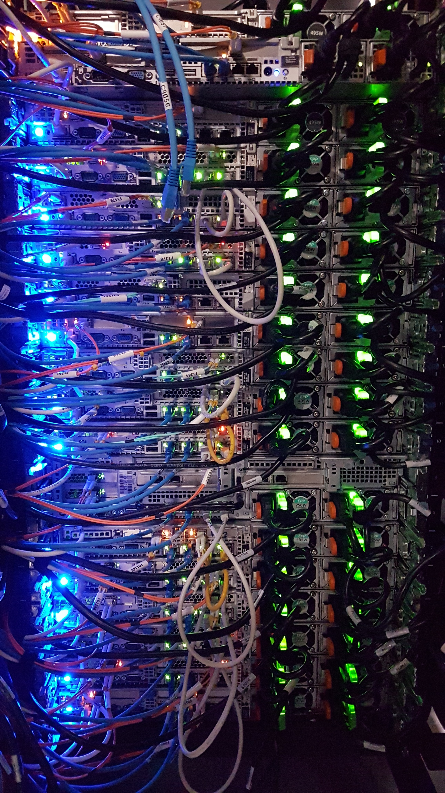
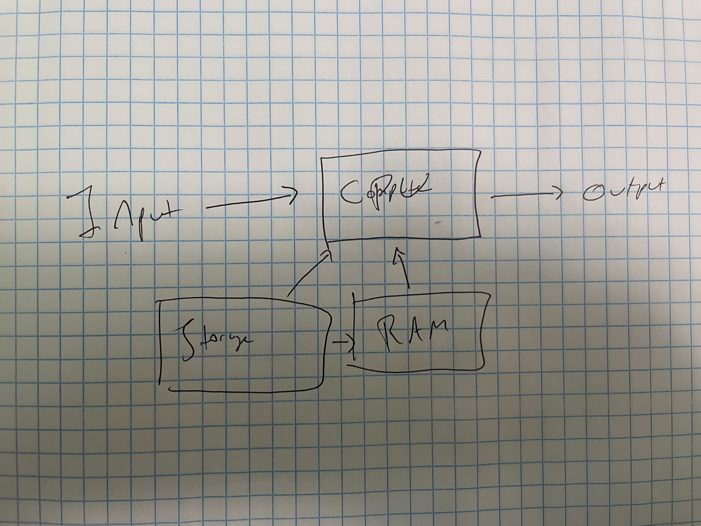

# Computers: where data science gets done

{width="400"}

A computer is just 1s and 0s. This is both true and entirely unhelpful. The mathematical basis for computing, which explains how optical, electrical, and magnetic impulses get turned into Facebook, Mario, a pandas dataframe, and everything else you've ever interacted with in a computer is both astounding and head-spinningly meta.

So fear not -- you don't need to be some Alan Turing-level mathematician, but understanding the important components in your computer, and how they work together will really help you comprehend what's going on when you use your computer in a professional context, and by the end of this chapter, we'll get to how that translates onto a server -- moving work off of your laptop and on to a remote server.

## Choosing your data science machine

Computers are kinda complicated. There are many interlocking components, each with specific attributes and a performance profile that make your computer work. Luckily, for a data scientist who just wants to be able to do their analyses, there are basically only five meaningful parts to a computer, and three (plus one) important attributes.

This diagram shows the five important computer components for a data scientist: input, compute, storage, memory, and output.

{width="400"}

There's a lot more detail below on each of these components and how they work together on your system.

In terms of performance, there are really only three important attributes of your machine (plus one) and number of CPU cores, core speed, amount of memory.

> If you're a data scientist working in R or Python, in most cases you'll want to choose a machine with fewer, faster cores and as much memory as you can reasonably get.

More details on why this is the case below.

Amount of storage is also relevant as a data scientist -- but only in the binary -- if you've got enough you'll never think about it and if you don't you'll never stop thinking about it. Get a lot. Storage is cheap these days -- way cheaper than you spending your time trying to manage things from eating up your storage.

### Input

**Input** is the incoming signal to the computer. This could be keyboard and mouse input on a desktop computer, a request coming in from a webapp, or a request for something from another computer. No matter what the originating form, by the time this gets to the computer, you can think of it just as a request to do something -- it doesn't matter whether it's to jump Mario over the chomp chain, type the word *umbrella* in your next novella, or run a regression in R. By the time it gets into your computer it's all just a bunch of input.

When you're working on your home computer, you'll never really think about this -- except if you're a person who loves those clacky mechanical keyboards. But it's all the same to the computer. Similarly, if you're on a server, whatever the default input speed is probably good enough.

### Compute 

Anything that actually happens in your computer is done by the compute part.

Back to the head-spinning genius of Alan Turing -- it turns out literally *everything* you do on your computer can be reduced to adding integers that are interpreted in different ways -- as colors, letters, shapes, or sometimes even as integers. Your CPU is very, very good at adding very, very fast.

CPUs have two important attributes to keep track of -- the number of cores and the speed of each core. You can think of a core as "a place where adding happens". Each core can do one addition at a time, so you can make your computer faster by either increasing the speed of each core, or adding more cores and parallelizing the operations. These days, midrange consumer laptops have somewhere between 4 and 16 cores.

You may also have access to a GPU. A GPU is exactly like a CPU conceptually. The main difference is that CPUs have a relatively small number of relatively fast cores, while a GPU has a very high number of relatively slow cores. As of this writing, CPUs for consumer-grade computers have around 4-16 cores, while GPUs have 700-4,000.

Setting up a GPU to do deep learning can be somewhat of a hassle, though it's getting easier all the time. This book isn't gong to go into the specifics of how to set up a GPU for deep learning applications.

It turns out that for a number of applications including playing video games, photo and video editing, some kinds of machine learning applications, and (yes) BitCoin mining, the "many slower cores" architecture results in huge speedups.

### Hard Drive/Storage/Disk

Storage is where your computer keeps things for later. Often called the hard drive.

There are two important attributes of your storage -- the amount measured in thousands (kilo-), millions (mega-), billions (giga-), trillions (terra-) of bytes. Depending on your application, you could also see thousands of terrabyes (petta-) or even thousands of pettabytes (yottabytes).

How fast your storage is also relevant - though rarely in real life. If your storage is fast enough, and most is, you'll never think about it. If your storage is not, your life will be full of pain.

For anything to happen to something in storage, it needs to be moved out of storage. In your mental model of your computer, the main thing to know is that this is a slow operation (though much faster if your machine has an SSD rather than a HDD).

### RAM/Memory

RAM (Random Access Memory) is the temporary storage your computer keeps for things you're actually using. It's quite a bit faster to access than your long-term hard drive storage. RAM can vary widely in terms of speed, but unless you're building your own computer, the main attribute you'll be considering is how much of it you need.

You can generally think of RAM as the working memory on your computer. Things you're actively working on will be stored in RAM ready for you to pick back up at a moment's notice. These days, computers are quite savvy about taking things you've walked away from, storing them to the hard drive temporarily, and then bringing them back again into RAM when you need them. Your computer does this all the time, and you probably haven't realized.

If you're coding in R or Python, the amount of RAM on your system will likely be the first time you'll pay attention to the computer itself. Any CPU or GPU can do anything any other one can (that whole Turing brain-spin again). But if you don't have enough RAM to do what you want to do, you'll quickly end up crashing your R or Python session.

Most operations R or Python operations require that you load all of your data into memory before you use it. You can get around this limitation by intelligently using a [database](#database) or libraries that facilitate on-disk operations like Apache Arrow. Depending on the size of your data and how computationally intensive your work is, this can be a real limitation on where you can do your work.

These days, most consumer grade laptops have around 8-32 Gb of RAM. Getting more RAM is one reason some data scientists decide to move to a server -- as you can rent a server with 1000 times as much RAM -- though ones that big are quite costly.

### Output

There's actually not a lot that's important to understand about output as a data scientist, except that it happens. The output of a calculation will go somewhere.

Sometimes this is just a write back into memory or onto the hard drive, but if you're working on a desktop, some kind of notification is usually output to your monitor or speakers. If you're on a server, there is no monitor or speakers, so the output goes out via some sort of networking device.

## Desktop vs Server

You've probably have heard of a server. Usually in regards to some far-off powerful computer, perhaps shrouded by clouds, and definitely capable of running circles around your puny laptop.

The reality of servers is far more quotidian. In fact, whether you're a data professional or not -- even if you've never written a single line of code, our lives are positively surrounded by servers.

By the end of this chapter, we'll demystify servers, help you understand how you use them in your daily life, and even get to the point where you can have one up and running all by yourself!

> A server is just a computer that lives somewhere else.

When you think of a computer, you probably think of your laptop -- a beautiful screen attached to a keyboard, multitouch trackpad, and somewhere in there, some guts that make the whole thing run. Let's take it a step back. Instead of everything in one box, imagine a desktop, which you might have -- or probably are at least familiar with. You've got the computer itself -- the whirring box with the fans -- and then you separately plug in (or wirelessly attach) a keyboard, mouse, monitor, and maybe some speakers.

Servers are simply the next evolution in this chain. A server is just the computer part of a computer -- no keyboard, mouse, or monitor. A server is valuable for its pure computing ability. Servers are the way the entire internet is stored, processed, and delivered to your eyes.

Here are a few ways you interact with servers in your daily life:

-   When you request directions from Google Maps on your phone, your phone makes a request to Google's servers to get the directions via a computer-to-computer application programming interface (API). Google's servers compute the directions you need and sends them back to your phone in a specialized response language (usually JSON). Your phone then renders the directions you need to your screen.

-   When you navigate to Facebook (or any other website), that company's servers send your computer back the components that make up that webpage. Your computer knows how to take those components and render them for you to view.

-   When you use your credit card at the grocery store, the credit card machine reaches out to the company's servers to verify that your card is valid and check that the item you're trying to purchase doesn't put you over your credit limit before verifying that the purchase is ok.

The list goes on and on and on. In 2021, servers are virtually all around us.

As you can see from the list above, there are a few different ways servers get accessed in your daily life. Sometimes you access a server when you go to a website and it sends you back content. Other times, you indirectly access a server via a machine-to-machine connection (usually an application programming interface -- API).

One thing you'll notice from the examples above is that servers (shockingly) are used to *serve* things to end-users. Unlike the desktop on your computer, you're generally not accessing the computer itself. In terms of using a server, that's the biggest difference between your laptop and a server. In most cases, a server doesn't have a desktop full of icons you can click to navigate.

In all the cases above, you were interacting with someone else's servers. So you're just interacting with the part of the server they've chosen to expose to the world. When you have your own server -- and we'll get there by the end of this chapter, you'll connect using a protocol called SSH -- there's a whole chapter on that -- and navigate and interact using command line interfaces (CLIs).

### Data Science on the server

Many data scientists and organizations are moving their data science work onto servers, as opposed to individual data scientists' desktops. When this happens, it generally falls into one of two patterns:

### Data Scientist-led server migration

This generally happens when one (or a few) data scientists need more horsepower for their analyses than they have on their laptops. These migrations tend to be quite ad-hoc, often involving servers that are transient for the duration of a project.

If you're in this situation, you probably have the advantage of getting to request whatever hardware specs you need. The downside is that the environment is likely to be temporary. It's often linked to a particular project with beefy server requirements, and the environment will go away when the project is over.

In many organizations, these instances aren't maintained as part of the IT organization's regular order, so they often fall to the individual data scientists who use them to provision, use, and maintain.

### SysAdmin-led server migration

More and more frequently, organizations are moving all (or many) of their data scientists into a server-based development environment. This is common in organizations where the IT/Admin group wants to maintain one centralized data science environment for everyone, as opposed to being responsible for helping each data scientist maintain an environment on their laptop.

This can be a great situation for data scientists - they get instant access through their web browser to more compute resources, and don't have to worry about maintaining local installations of data science tools like R, Python, RStudio, Jupyter, and connections to important data sources -- those things are just theirs for the taking.

So much of whether the server-based experience is good or not depends on the relationship between the data science and IT/Admin group. In organizations where these groups work together smootly, this can be a huge win for everyone involved. However, there are some organizations where IT/Admins are so concerned with stability and security that they make it impossible to do data science, and the data scientists spend all their time playing cat-and-mouse games to try to get work done behind IT/Admin's backs.

If you work at such a place, it's frankly hard to get much done. It's probably worth investing some time into improving your relationship with your favorite person on the IT/Admin team.

## Getting to a Server

When you access the computer sitting on your desk, you just wiggle the mouse to wake it up, put in a password, and you're off to the races. With a server, the situation is a little more complicated.

-   How you know where to access a server
-   Lots of layers, but controls access to the servers doors
-   Different from authentication, which determines who gets let into doors

## How is a server different from my laptop? [maybe make a table?]

-   OS
-   How you access
-   Server software (NGINX)

## How can I get my very own server?

-   Cloud free tiers
-   Walk through creating account, logging in, getting EC2 set up
-   Access using PEM key (point to SSH chapter)
-   Set up NGINX

## Exercises:

1.  Consider a simple data science app that allows an end user to view data. Can you draw a diagram of how that app could be deployed on remote servers? Where could the data live? How would users access the app? How would you access the app to do maintenance?
2.  Try standing up your own server in one of the major cloud providers and accessing it using the provided .pem key.
