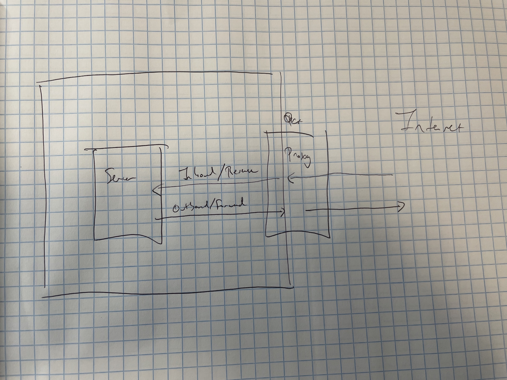
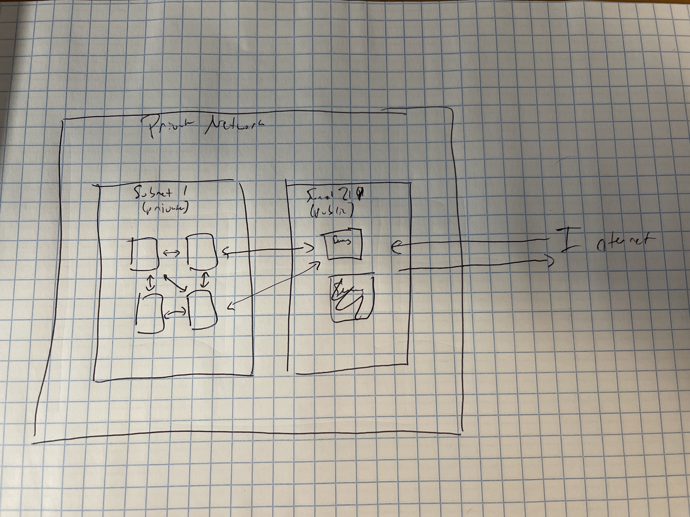

# Networking and the Internet {#networking}

Anything that happens on a computer network - watching a video of cute dogs, checking your bank balance, fetching data from your SQL server, or viewing the Dash app your colleague shared -- is the result of computers trading *requests* and *responses*. Networking is the plumbing that allows the requests and responses to be smoothly passed back and forth across the globe.

Networking is about layers and layers of protocols.

In this chapter, we'll develop a mental model for how networking works, especially the components that are important if you're setting up your own server, or working with the IT/Admins at your organization to do so.

## Structure of a URL

{width="423"}

## How requests find their way with DNS

The first thing that happens is my browser generates and sends off an *request* to go fetch whatever is at `blog.example.com/engineering` using the `https` application-layer protocol.[^networking-1] More on application protocols in a little bit.

[^networking-1]: If you're curious, the request is formatted as one or more *packets*. In the case of the request or response constituting more than one packet, each is independently routed and reassembled when they arrive. This fact is in a footnote because it is both true and unimportant to understanding networking for our purposes.

The first stop of any traffic is a domain name system (DNS) server.

In computer networks, entities are identified by IP addresses, rather than the friendly URLs we use in our daily lives. DNS is the decentralized system of phone books that translates back and forth between human-readable URLs and IP addresses.

Your query goes through several layers of DNS servers, starting with the server that just tells your request "Where is the right DNS server for `.com` domains?". By the time the request is done with public DNS servers, it will have resolved `example.com` to a public IP address -- let's say it's `142.11.44.243`.

In general, this is the address *not* of your website itself, but of another, private DNS server that will resolve the subdomain `blog` to the right actual IP address. Eventually, your request will make its way to an actual server that is setup to serve the content relevant to `blog.example.com`. Your request will then present itself, asking for whatever's at the subpath `/engineering`, and asking to get it using `https`.

As you get deeper into using servers, you will learn to hate DNS with a fiery passion. While it's necessary so we're not running around trying to remember long numbers, it's also very hard to debug as a server admin.

Let's say I've got the public domain `example.com`, and I'm taking down the server and putting up a new one. I've got to alter the public DNS record so that everyone going to `example.com` gets routed to the new IP address, and not the old one.

The thing that makes it particularly challenging is that the DNS system is decentralized. There are thousands of public DNS servers that a request could get routed to. In order for every request to be routed correctly, every server needs to be updated with every single change to every single public IP address and URL in the world.

Obviously, this is a difficult problem to solve, and it can take up to 24 hours for DNS changes to propagate across the network.

To add an additional layer of complexity, DNS lookups are slow, so your browser caches the results of DNS lookups it has done before. That means that it's possible you'll still get an old website even once the public DNS record has been updated. If a website has ever not worked for you and then worked when you tried a private browser, DNS cacheing is likely the culprit. Using a private browsing window sidesteps your main DNS cache and forces lookups to happen afresh.

### An aside about IP addresses...

As you start working more intimately with servers, you'll spend more time staring at IP addresses, so it's worth taking a moment to talk about how to recognize them.

You've mostly likely seen an IPv4 address before. They're made up of four blocks of 8-bit fields (integers up to 256), so they look like `0.0.0.0` to `255.255.255.255`. If you do the math, you'll realize there are *"only"* about 4.3 billion of these, which it turns out is not enough and we're running out.

In the last few years, adoption of the new standard IPv6 addresses has started. They'll coexist with IPv4 for a few decades, and we'll eventually switch entirely to IPv6. There's no worry about running out of IPv6 addresses any time soon, because the number of distinct IPv6 addresses is 39 digits long.

So you know what they look like, IPv6 addresses are eight blocks of hexadecimal (`0-9` + `a-f`) digits separated by colons, with certain rules that allow them to be shortened, so `4b01:0db8:85a3:0000:0000:8a2e:0370:7334` or `3da4:66a::1` are both examples of valid IPv6 addresses.

### Ports

I find it helpful to think of a server like a big apartment building. Inside that apartment building is a program, waiting to return something to the outside world when it's requested. The request finds the right apartment with a *port*.

There is a 1-1 correspondence between ports and running services -- so each port routes traffic to exactly one service running on the server.

There are over 65,000 ports available for every IP address. Ports are specified by a set of numbers after a colon. So something addressed to `example.com:9932` would go to the service listening on port `9932` at the IP address for `example.com`.

Some ports are reserved for special purposes. For example, when you stood up your server in the first chapter, the only port open by default was `22`, which is the default port for SSH traffic. In this chapter, we haven't bothered to specify a port for our request. That's because `http` traffic defaults to port `80`, and `https` defaults to port `443`.

There's a cheatsheet of common ports at the end of this chapter.

Many server-based pieces of software have default ports, which they'll use unless you specify otherwise. For example RStudio Server uses port `8787` by default, so when you set up RStudio Server, you'll access it at `<public-ip>:8787` unless you specify a different port.

When your computer makes an outbound internet request, it actually opens up a random port waiting for a response, and specifies the port in the outbound message as part of the return address.

## HTTP(S) and friends

When you go to a website on the internet, you'll see the URL prefixed by the `https` (though it's sometimes hidden by your browser because it's assumed). `https` is an *application layer protocol* for delivering content across the internet.

Application layer protocols define how the server should understand the request that was sent and what are legitimate things to send back. `http` is the protocol that defines how to fetch documents across networks -- the most common types of documents on the internet being HTML webpages.

In fact, `https` is actually a mashup of two things -- the `http` application protocol and securing that traffic with SSL/TLS.

These days, basically all `http` traffic on the internet is secure, but you may see plain `http` traffic inside private networks. There are many other protocols, some of which have similar secured/non-secured flavors. Some you'll see in this book include `SSH` for direct server access, `(S)FTP` for file transfers, `LDAP(S)` for authentication, and `websockets` for persistent bi-directional communication -- used for interactive webapps created by the Shiny package in R and the Streamlit package in Python.

\#TODO: How does SSL work?

## Private Networks

If you're maintaining servers for your organization, they're going to be inside a private network that you maintain. We'll get to a bunch of things using a private network enables, but the first thing that's really nice about using a private network is that you can have servers with IP addresses and hostnames that are specific to the network, without having to worry about conflicts with the outside world. It's just like the way a variable name inside an R or Python function is namespaced so that you don't have to worry about conflicts with other functions.

{width="429"}

The front gate of each private network is networking apparatus to do translation back and forth between private and public IP addresses. In most cases though, you won't deal with IP addresses at all. Networks use a service called Dynamic Host Configuration Protocol (DHCP) to assign IP addresses to nodes as they join the network.

Inside the network, you'll usually configure hostnames, so that you can refer to different servers in the network by a name instead of an IP address. This is good because the D in DHCP stands for dynamic. In most cases, if you replace a server, it won't get the same IP address, so it's nice to use private DNS to be able to swap out a hostname for a different server without having to worry about having to reconfigure things to use a new IP address. For example, you'd have to redo all your database queries.

### Proxies

In many cases, there will be one more `proxy` layer. A proxy is a generic term for a server that routes traffic between networks or parts of a network. We talk about proxies from the perspective of the servers that sit behind them, so a proxy that does something to inbound traffic is called a *reverse proxy*, and one that does something to outbound traffic is a *forward proxy*. I personally prefer the terms inbound and outbound proxy, because I find them clearer and easier to remember.

{width="495"}

\#TODO: Label private network

Proxies -- path rewriting, load-balancing, authentication

### Subnets

Each private network is split into *subnets*. In the simplest case, there is just one subnet that is the entire private network, but that usually isn't the case. In most cases, you'll have at least two subnets -- one public and one private.

{width="376"}

There are two main advantages to using a private network over putting servers on the open internet. In some cases, you'll have servers that shouldn't be accessible to the internet at all. For example, you probably don't want your organization's analytics database accessible to anyone outside the network. While you could put that server on the internet and just close all the ports, allowing the server internet access adds a potential risk vector it'd be nicer to just not have to worry about.

The other reason to make extensive use of private networks has to do with ease-of-configuration. Inside a private network, it's generally ok to say "accept connections from any server inside the network", and take care of security at the front gate of the network. Otherwise, you've got to be much more careful about how you configure each individual server, which is both more work and a potential security vulnerability if you don't do it right.

In the case of a data science environment you may have a number of different servers you're setting up -- a server for doing data science work, a database, a package repository mirror, and a server for deploying your apps to others.

Similarly, because there are single points of ingress and egress (sometimes), security is heightened by having only one way in or out, as opposed to opening the entire network or each server individually to the internet.

Using public and private subnets is also really nice for server resiliency. Say your network was attacked with a DDOS attack, where someone tries to overwhelm your servers with junk attacks to take down your servers. It's way better if they manage to succeed at taking down your server, but it's just a proxy as opposed to your analytics workhorse server or a mission-critical database.

### Ingress

For traffic coming into the VPC, there are two different routes - one for HTTP(S) traffic, and one for SSH traffic. SSH traffic comes through a bastion host, designed precisely for this purpose.

Bastion hosts sit in a public subnet of a VPC with a publicly addressable IP and domain name (often called a DMZ) and are designed to be an SSH "jump host" into the other nodes inside the VPC.

For HTTP(S) traffic, the ALB (AWS's newest form of load balancer) sits in the public subnet and proxies traffic into the private subnets.

Security groups are set up to allow HTTP traffic from the ALB =\> private hosts, and SSH traffic from the bastion hosts =\> private hosts.

## Configuring your own data science garden

EC2

Database

Proxy

Public + Private Subnets

A private network is defined by a range of IP addresses, called CIDR blocks. A CIDR block defines the sub-addresses available inside an IP address using a `/n` notation. So the CIDR block `10.0.0.0/16` is the largest possible CIDR block and includes all IP addresses from `10.0.0.0` to `10.255.255.255`.

The numbers after the / are related to powers of 2 (binary something blah), so you can fit 2 `/x+1` CIDR blocks in a single `/x` block.

So, for example, there are 128 IP addresses in a `/25` CIDR block, and 256 in a `/24` CIDR block, so `10.0.0.0/24` could have two subnets, `10.0.0.0/25` and `10.0.0.128/25`.

## Offline + Airgapped Configurations

In AWS, you'll configure egress from private subnets using a NAT Gateway. Egress from the public subnets goes through the Internet Gateway. Egress is actually needed less than you might think - in our current setup, it's needed for package updates to RSPM (the RSPM service, not RSP to RSPM), to do google OAuth to the google servers (rstudioservices only), get stuff from github, update products, and get content from apt/yum repos.

In Colorado, it's not needed for RSC because the SAML token is in the browser. It is needed for RSP because Onelogin is outside the VPC. This is generally not the case for customers, who are mostly using on-prem AD servers.

## Special IP Addresses and Ports

127.0.0.1 - localhost

0.0.0.0 - unspecified

All ports below 1024 reserved.

80 - HTTP default

443 - HTTPS default

22 - SSH default

## Special HTTP(S) Codes

200

404

403

## Exercises

1.  Consider going to the website google.com. Draw a diagram of how the following are incorporated: TCP/IP, DNS, HTTP, HTTPS.

2.  Set up a free-tier EC2 instance and put an NGINX server up. Figure out how to allow your computer to access the server, but not your phone. Try accessing it on a non-default port.

3.  Try to HTTP into a fresh EC2 with the default security group. Take a look at the inbound security group rules. *Hint: is there an inbound rule on a default HTTP port?*

4.  SSH into your EC2 instance and try to reach out to something on the internet (curl...). See if you can change security group rules to shut down access.

    1.  Can you do it by changing the IP address range it's accepting connections from?

    2.  Can you do it by changing the listening ports?

CIDR

Subnets
