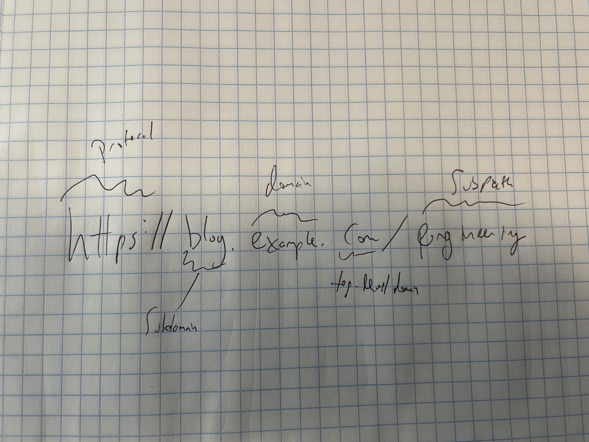

# Networking and the Internet {#networking}

Anything that happens on a computer network - watching a video of cute dogs, checking your bank balance, fetching data from your SQL server, or viewing the Dash app your colleague shared -- is the result of computers trading *requests* and *responses*. Networking is the plumbing that allows the requests and responses to be smoothly passed back and forth across the globe.

Networking is about layers and layers of protocols.

In this chapter, we'll develop a mental model for how networking works, especially the components that are important if you're setting up your own server, or working with the IT/Admins at your organization to do so.

## Finding the right server

Let's start with a specific example. Let's say I want to visit the engineering blog of my favorite tech company, so I type `https://blog.example.com/engineering` into the navigation bar and hit `Enter`.

{width="423"}

The first thing that happens is my browser generates and sends off an *request* to go fetch whatever is at `blog.example.com/engineering` using the `https` application-layer protocol.[^networking-1] More on application protocols in a little bit.

[^networking-1]: If you're curious, the request is formatted as one or more *packets*. In the case of the request or response constituting more than one packet, each is independently routed and reassembled when they arrive. This fact is in a footnote because it is both true and unimportant to understanding networking for our purposes.

The first stop of any traffic is a domain name system (DNS) server.

In computer networks, entities are identified by IP addresses, rather than the friendly URLs we use in our daily lives. DNS is the decentralized system of phone books that translates back and forth between human-readable URLs and IP addresses.

Your query goes through several layers of DNS servers, starting with the server that just tells your request "Where is the right DNS server for `.com` domains?". By the time the request is done with public DNS servers, it will have resolved `example.com` to a public IP address -- let's say it's `142.11.44.243`.

In general, this is the address *not* of your website itself, but of another, private DNS server that will resolve the subdomain `blog` to the right actual IP address.

\#TODO: setting up subdomains + paths

So eventually, we have made our way to the actual server that hosts `example.com`'s blog. Now we just have to find the website we came to get.

### An aside about IP addresses...

As you start working more intimately with servers, you'll spend more time staring at IP addresses, so it's worth taking a moment to talk about how to recognize them.

You've mostly likely seen an IPv4 address before. They're made up of four blocks of 8-bit fields (integers up to 256), so they look like `0.0.0.0` to `255.255.255.255`. If you do the math, you'll realize there are *"only"* about 4.3 billion of these, which it turns out is not enough and we're running out.

In the last few years, adoption of the new standard IPv6 addresses has started. They'll coexist with IPv4 for a few decades, and we'll eventually switch entirely to IPv6. There's no worry about running out of IPv6 addresses any time soon, because the number of distinct IPv6 addresses is 39 digits long.

So you know what they look like, IPv6 addresses are eight blocks of hexadecimal (`0-9` + `a-f`) digits separated by colons, with certain rules that allow them to be shortened, so `4b01:0db8:85a3:0000:0000:8a2e:0370:7334` or `3da4:66a::1` are both examples of valid IPv6 addresses.

## Finding content inside the private network

We are here -- the request has gotten to the network that will give me the blog. One of the principles of computer networking is that every interaction is point-to-point -- that is, the request is never gaining information more than one step ahead on its journey.

So I like to imagine my request as sitting at the entry to a gated community filled with apartment buildings. The request knows its here to see `/engineering` and to get whatever's there with `https`, but it needs to get to the right building, and then to the right apartment.

### Entering the private network

You can think of the internet as a huge series of gated communities. In some cases, the server is sitting right on the street. When we first stood up a server back in section 1, it was directly connected to the internet. We accessed it using the public IP address listed in the AWS console.

If you're setting up a very simple environment, perhaps just a single server, you *can* put the server directly on the internet. But this isn't a best-practice.

In most cases, you'll put your new server inside a private network. A private network is a walled-off community where your various servers can interact with each other.

There are two main advantages to using a private network over putting servers on the open internet. In some cases, you'll have servers that shouldn't be accessible to the internet at all. For example, you probably don't want your organization's analytics database accessible to anyone outside the network. While you could put that server on the internet and just close all the ports, allowing the server internet access adds a potential risk vector it'd be nicer to just not have to worry about.

The other reason to make extensive use of private networks has to do with ease-of-configuration. Inside a private network, it's generally ok to say "accept connections from any server inside the network", and take care of security at the front gate of the network. Otherwise, you've got to be much more careful about how you configure each individual server, which is both more work and a potential security vulnerability if you don't do it right.

In the case of a data science environment you may have a number of different servers you're setting up -- a server for doing data science work, a database, a package repository mirror, and a server for deploying your apps to others.

Similarly, because there are single points of ingress and egress (sometimes), security is heightened by having only one way in or out, as opposed to opening the entire network or each server individually to the internet.

The idea of having a VPC is twofold - firstly it simplifies logic inside the VPC. You don't have to worry about how things are accessed from the internet. Things can talk to each other using IP addresses (or DNS names) that aren't configured to the internet, but just within the VPC. Inside the private network, IP addresses are only inside the private network (like namespace inside a function in R or Python).

Example: DDOS attack stopped at the proxy

Communication in private network

A private network is defined by a range of IP addresses, called CIDR blocks. A CIDR block defines the sub-addresses available inside an IP address using a `/n` notation. So the CIDR block `10.0.0.0/16` is the largest possible CIDR block and includes all IP addresses from `10.0.0.0` to `10.255.255.255`.

The numbers after the / are related to powers of 2 (binary something blah), so you can fit 2 `/x+1` CIDR blocks in a single `/x` block.

So, for example, there are 128 IP addresses in a `/25` CIDR block, and 256 in a `/24` CIDR block, so `10.0.0.0/24` could have two subnets, `10.0.0.0/25` and `10.0.0.128/25`.

If you're defining a CIDR block on AWS, it would be to have a CIDR block For IPv4 address 0.0.0.0, the CIDR block would be 0.0.0.0/xx. A lower number indicates a wider set of IP addresses -- i.e. 0.0.0.0/16 has more addresses than 0.0.0.0/18.

Within a VPC, CIDR blocks are internal to the VPC and so IP addresses must come from a range reserved for [private IP addresses]((https://en.wikipedia.org/wiki/Private_network). At RStudio, we use ranges in the 172 block for private IPs.

Can put server right on the internet

Usually a VPC

VPCs subdivided into subnets

\

\

## Securing the VPC

Within a VPC, you'll likely configure both public and private subnets. By default, private subnets have no way in or out.

\

## Egress

In AWS, you'll configure egress from private subnets using a NAT Gateway. Egress from the public subnets goes through the Internet Gateway. Egress is actually needed less than you might think - in our current setup, it's needed for package updates to RSPM (the RSPM service, not RSP to RSPM), to do google OAuth to the google servers (rstudioservices only), get stuff from github, update products, and get content from apt/yum repos.

\

In Colorado, it's not needed for RSC because the SAML token is in the browser. It is needed for RSP because Onelogin is outside the VPC. This is generally not the case for customers, who are mostly using on-prem AD servers.

\

## Ingress

For traffic coming into the VPC, there are two different routes - one for HTTP(S) traffic, and one for SSH traffic. SSH traffic comes through a bastion host, designed precisely for this purpose.

\

Bastion hosts sit in a public subnet of a VPC with a publicly addressable IP and domain name (often called a DMZ) and are designed to be an SSH "jump host" into the other nodes inside the VPC.

\

For HTTP(S) traffic, the ALB (AWS's newest form of load balancer) sits in the public subnet and proxies traffic into the private subnets.

\

Security groups are set up to allow HTTP traffic from the ALB =\> private hosts, and SSH traffic from the bastion hosts =\> private hosts.

\

## CIDR Blocks 

\

Because these are private IP addresses you could theoretically use any range you want, with a few caveats:

\

1\. We do not use the 10 block of private IPs because they are reserved with EC2 classic instances by AWS. This is increasingly unlikely to be relevant, as EC2 classic instances are older and older.

\

2\. If you ever need [VPC peering](https://docs.aws.amazon.com/vpc/latest/peering/what-is-vpc-peering.html), for example for a VPN, the address spaces cannot overlap between the two VPCs, so it's good to make sure that a new permanent VPC doesn't overlap with others at RStudio. This is not an issue for "throwaway" VPCs.

\

There is a google doc somewhere with the IP address ranges for our VPCs. Ask in \#x-ops if you need it.

\

# Route 53

\

Route 53 is AWS's DNS-as-a-service tool. It allows you to map DNS names to IP addresses. It is worth noting that it can map DNS names to IP addresses in "public" hosted zones (resolvable anywhere) and "private"
hosted zones (resolvable only within the VPC).

\

One thing to note -- in general the RStudio main accounts owns e.g. [rstudioservices.com](http://rstudioservices.com), but they have delegated [soleng.rstudioservices.com](http://soleng.rstudioservices.com) and everything under it to the soleng subaccount.

### Ports

I find it helpful to think of a server like a big apartment building. Inside that apartment building is a program, waiting to return something to the outside world when it's requested. The request finds the right apartment with a *port*.

There are over 65,000 ports available for every IP address. Ports are specified by a set of numbers after a colon. So something addressed to `example.com:9932` would go to the service listening on port `9932` at the IP address indicated by the public DNS entry for `my-website.com`.

There is a 1-1 correspondence between ports and running services -- so each port routes traffic to exactly one service running on the server.

Some ports are reserved for special purposes. For example, when you stood up your server in the first chapter, the only port open by default was `22`, which is the default port for SSH traffic. In this chapter, we haven't bothered to specify a port for our request. That's because `http` traffic defaults to port `80`, and `https` defaults to port `443`.

There's a cheatsheet of common ports at the end of this chapter.

Many server-based pieces of software have default ports, which they'll use unless you specify otherwise. For example RStudio Server uses port `8787` by default, so when you set up RStudio Server, you'll access it at `<public-ip>:8787` unless you specify a different port.

## Hating DNS

As you get deeper into using servers, you will learn to hate DNS with a fiery passion. While it's necessary so we're not running around trying to remember long numbers, it's also very hard to debug as a server admin.

Let's say I've got the public domain `example.com`, and I'm taking down the server and putting up a new one. I've got to alter the public DNS record so that everyone going to `example.com` gets routed to the new IP address, and not the old one.

The thing that makes it particularly challenging is that the DNS system is decentralized. There are thousands of public DNS servers that a request could get routed to. In order for every request to be routed correctly, every server needs to be updated with every single change to every single public IP address and URL in the world.

Obviously, this is a difficult problem to solve, and it can take up to 24 hours for DNS changes to propagate across the network.

To add an additional layer of complexity, DNS lookups are slow, so your browser caches the results of DNS lookups it has done before. That means that it's possible you'll still get an old website even once the public DNS record has been updated. If a website has ever not worked for you and then worked when you tried a private browser, DNS cacheing is likely the culprit. Using a private browsing window sidesteps your main DNS cache and forces lookups to happen afresh.

## Proxies and the Walled Garden

Finally, the request arrives at `example.com`'s front door. The important thing to realize is that the server at `example.com` could be the actual server for `example.com`, or it could just be a network appliance like a proxy or load-balancer into a walled garden.

`https` is the protocol used for fetching websites, so it's pretty much the only one you see in normal internet browsing. But there are dozens of other protocols that are in use behind the scenes. Some other application protocols you'll encounter in different sections of this book include `SSH`, `SFTP`, and `LDAP`.

`https` actually indicates three different things about the protocol:

-   This is an `http` (document fetching) request

-   Secure it using `SSL` (more on that below)

-   Try to access port 443 on the host machine

<aside>

</aside>

The protocol at the front of the URL indicates that this will be an `HTTP` request

When you first go to your browser and type the URL in the address bar, your computer generates a *request* to `www.alexkgold.space` asking it to please send back the contents of the website in a *response*.

Note that `https` actually isn't part of the URL. Instead, `http` - short for hypertext transfer protocol -- is actually the *application layer protocol* that you're using. `HTTP` is the protocol used for fetching documents, like websites, so it's pretty much the only one you see in normal internet browsing. But there are dozens of other protocols that are in use behind the scenes. Some other application protocols you'll encounter in different sections of this book are `SSH`, `SFTP`, `LDAP`.

Somewhere, there is a server where the contents of my website are sitting as files waiting to be sent to your computer when requested. They're just files. So how does your request know where to go?

Each computer within a particular network is given a unique internet protocol (IP) address, which is how computers actually find each other. So if you've ever created a website before and registered a domain name, you've added your own entry to the DNS phonebook.

So now, the original to: address of `www.my-website.com` has been scratched out in favor of the IP address, so it can actually be routed where its going.

From the DNS server, the request starts making its way across the *nodes* of the network. Any entity in the network is called a node, and some -- like routers, modems, and switches -- are there to deal with the traffic itself. The ones that do things for the end-users, like your computer, phone, printer, and the servers they're going to are called *hosts*.

Each node in the network tries to determine the next node for the request to go to. But at no point does any node try to determine the entire path the request should follow. This is by design! It helps make the system more robust and actually allows for faster traffic. But this might mean that the different packets constituting a single request follow different paths. That's fine!

DHCP

## 

From the outside world, your entire home network has only 1 public IP address.[^networking-2] You can find it by simply typing `what's my ip address` in google or another search engine. So when you go to a website, your computer sends out a request to an external server, with the return address of your home network's public IP address, and your computer's IP address within that network.

[^networking-2]: Usually. Most home WiFi networks have only one, but it's possible you've got multiple. Your school or workplace's private network likely has several.

\#TODO: graphic of public/private IP translation

### Finding IP Addresses with DNS and DHCP

The way DNS actually works is complicated, but one of the most important things to know is that it's kinda a pain. If you're trying to set up a server at an actual URL, you'll need to register a domain name and get it associated with your server. This takes time -- they say as much as 24-48 hours for DNS changes to propagate through the public servers that every computer connected to the internet might reach.

In order to avoid having to constantly reach out to DNS servers, your computer keeps a DNS cache locally. As you're working on servers, you may find that something suddenly becomes unreachable. A great first troubleshooting step is always to try using an incognito window as it will ignore your DNS cache and reach out to the DNS server afresh.

In contrast, the IP addresses for individual hosts or nodes on a network are ephemeral and are assigned via centralized Dynamic Host Cofiguration Protocol (DHCP) servers. The details aren't super important, but the good news is that when you're setting up servers for something permanent, you'll usually want to configure *hostnames* for the servers, rather than assuming that IP addresses will be static over time.

## Application Protocols: Reading the mail

So, your packet request has made it to the server on the other end, found the right port, and made it to the listening service. Time to open the envelope. What's inside?

This is where the *application layer protocol* kicks in. The application layer protocol defines how the server should understand the request that was sent and what are legitimate things to send back. There are many application layer protocols for everything from file transfers to email traffic, checking user permissions to database access.

There are a few particular application protocols that come up quite often for the working data scientist:

-   **HTTP** is how you look at websites in a web browser. To be slightly more technical, defines a client/server relationship where the client makes requests that the server fulfills.

-   **FTP/SFTP** is a protocol for transferring files directly from one computer to another.

-   **SSH** is a protocol for securely accessing a remote computer over a network. It's important enough for data scientists that there's a [whole chapter](#ssh) on it.

-   **Websockets** are a protocol for doing interactivity with a website. Many popular R and Python web frameworks use websockets, including the Shiny R package and the Streamlit Python package.

### HTTP and HTTPs

HTTP is a particularly important protocol to understand because it forms the basis for most of the way we interact with the internet. As a data scientist, you also may need to interact directly with HTTP traffic making API calls or writing your own API to serve data science results to others.

-   Secured HTTP

-   End-to-end encryption using Transport Layer Security (TLS) or Secure Sockets Layer (SSL) HTTP over TLS/SSL

-   Getting and configuring an SSL certificate

## Networking for your data science servers

The biggest and best known of computer networks is the internet. But at its core, the internet is just another computer network, so the same principles apply to both public and private networks.

For the most part,

[Diagram: Common Network Topology]

-   Most work occurs inside a VPC

-   IP addresses inside a VPC can be assigned as you wish

    -   Subject to CIDR block rules

-   Need translation between inside and outside -\> proxy

    -   If being used for SSH access, usually called bastion

-   Proxies commonly used to serve as firewalls, network address translators, load-balancers

-   Forward (outbound) proxy vs reverse (inbound) proxy

-   Private vs public subnets

-   Particular ports being "open"

## Special IP Addresses and Ports

127.0.0.1 - localhost

0.0.0.0 - unspecified

All ports below 1024 reserved.

80 - HTTP default

443 - HTTPS default

22 - SSH default

## Special HTTP(S) Codes

200

404

403

## Exercises

1.  Consider going to the website google.com. Draw a diagram of how the following are incorporated: TCP/IP, DNS, HTTP, HTTPS.

2.  Set up a free-tier EC2 instance and put an NGINX server up. Figure out how to allow your computer to access the server, but not your phone. Try accessing it on a non-default port.

3.  Try to HTTP into a fresh EC2 with the default security group. Take a look at the inbound security group rules. *Hint: is there an inbound rule on a default HTTP port?*

4.  SSH into your EC2 instance and try to reach out to something on the internet (curl...). See if you can change security group rules to shut down access.

    1.  Can you do it by changing the IP address range it's accepting connections from?

    2.  Can you do it by changing the listening ports?

CIDR

Subnets
