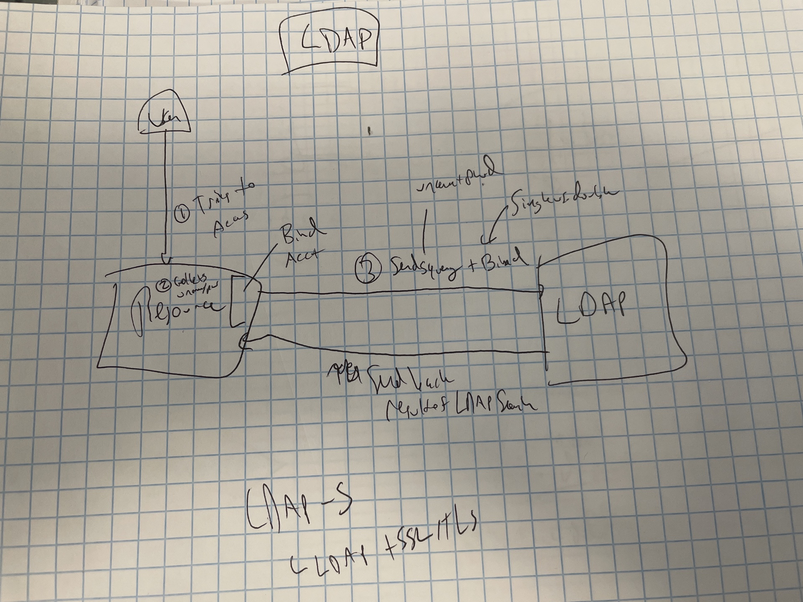

# Authentication -- Making Login Possible {#auth}

## Your Everyday Experience of Auth and How it Differs from Enterprise

-   You do auth all the time

-   Private auth -- login to your bank with a unique username and pw

-   MFA (2FA) -- get a text message or use an authenticator token

    -   Or yubikey, etc

-   Public auth -- you might login to spotify using your facebook,
    apple, or google credentials

    -   Spotify is a Service Provider and the other side an Identity
        Provider

## What is Authentication?

1)  Check who you are - Authentication
2)  Check whether you should have access - Authorization

User goes to login:

1)  Make the user provide creds (username/password)
2)  System checks credentials against store
3)  (For SSO) Check if user is allowed to access resource
4)  Send back *something*
5)  User is authorized

## Experiences of Different Auth Systems

-   For users

    -   Do I have to authenticate to do X?
    -   Where do I authenticate?
    -   With which credentials?

-   For Admins

    -   Am I transmitting user details, or just an authentication
        token/ticket?

        -   Security

    -   Can I easily manage access centrally?

    -   Can I keep credential stores centralized?

    -   How are users created (provisioned) and deprovisioned

    -   Do we have to maintain our own auth server?

Differences between auth types 1) How is the communication done?
Transmit text vs token (type/encryption) 2) When is the identity
checked? Once, every time 3) When is authorization checked? 4) How
encrypted are things?

What does SSO mean? \* Most commonly used to mean login once and then
authentication happens automatically for duration of session \*
Sometimes just used to mean that people use the same username and
password across different systems

## Types of Credentials

### Usernames and Passwords

### Keys

### Tokens

### More Factors

## Auth Techniques

There are two main cont

-   How to manage large groups of users with different permissions

### Authorization: Groups, Roles, and Permissions

-   Groups: sets of users (e.g. `data-science`)
-   Roles: Role a user should have in the system (e.g. `admin`)
-   Permissions: things someone can do -- can be granted on the basis of
    membership in a group, role grants, or other attributes
-   Groups and roles are maintained in the central user store

### Service Accounts

-   Often used in contexts where a service is accessing something on
    behalf of itself

    -   e.g. an app accessing a database on behalf of any user who can
        access the app

### Instance Permissions

-   Often done inside private networks -- instead of providing auth on a
    per-user/session basis, just allow an entire server access to
    another
-   e.g. any connection to the database by server A is allowed

## Auth Technologies

### Username + Password

Many pieces of software come with integrated authentication. When you
use those system, the product stores encrypted username and password
pairs in a database.

These setups are often really easy from an admin perspective -- you just
set up individual users on the server. However, the flip side is that
users have one more username and password to remember, which is annoying
for them. Moreover, if you have more than a few users, or the system is
one of more than a few, it's hard to manage users on a lot of different
systems. It can be a real pain to create accounts on a ton of different
systems when a new person joins the organization, or to remove their
permissions one-by-one when they leave.

For this reason, most IT/Admin organizations strongly prefer using some
sort of centralized identity store.

### PAM

### LDAP/AD

Lightweight Directory Access Protocol (LDAP) is a relatively old, open,
protocol used for maintaining a set of entities and their attributes. To
be precise, LDAP is actually a protocol for maintaining and accessing
entities and their attributes in a tree. It happens that this is a
really good structure for maintaining permissions and roles of users at
an organization, and it's the main thing LDAP is used for.

Active Directory (AD) is Microsoft's implementation of LDAP, and is
by-far the most common LDAP "flavor" out there. AD so thoroughly owns
the LDAP enterprise market, that LDAP is often referred to as LDAP/AD.
There are other implementations you may run across, the most common
being OpenLDAP.

<aside>

Azure, Microsoft's cloud provider, offers an authentication service
called *Azure Active Directory (AAD)*. Confusingly, AAD is usually used
in combination with SAML, not LDAP.

</aside>

It's worth distinguishing the use of LDAP as an identity store from its
use as an authentication technology. As a tree-based database, LDAP is
uniquely well-suited to storing the identities, and other attributes of
people at the organization. However, as discussed below, using LDAP to
authenticate into actual services has security and convenience
drawbacks, and many organizations consider it outdated and insecure.

A lot of organizations are moving away from LDAP for authentication in
favor of token-based technologies like SAML or OAuth, but many are
keeping LDAP as their identity "source of truth" that is referenced by
the SAML or OAuth Identity Provider.

LDAP has three main disadvantages relative to other technologies. First,
LDAP requires that your credentials (username and password, usually)
actually be provided to the service you're trying to use. This is
fundamentally insecure relative to a system where your credentials are
provided only to the identity provider, and the service just gets a
token verifying who you are. In token-based systems, adding additional
requirements like MFA or biometrics are easy, as they're simply added at
the IdP layer. In contrast, doing those things in LDAP would require the
service to implement them, which usually is not the case, so you're
usually limited to username and password.

The second disadvantage of LDAP is that it does not allow for central
administration of permissions. LDAP directly records only objects and
their attributes. Say, for example, you want only users of a particular
group to have access to a certain resource. In LDAP, you would have to
specify *in that resource* that it should only allow in users of that
group. This is in contrast to SAML/OAuth, where the authorization is
centrally managed.

Lastly, LDAP authentication is based on each service authenticating.
Once you authenticate, the service might give you a cookie so that your
login persists, but there is no general-purpose token that will allow
you to login to multiple services.

#### How LDAP Works

While the technical downsides of LDAP are real, the tradeoff is that the
technical operations of LDAP are pretty straightforward. In short, you
try to login to a service, the service collects your username and
password, sends it off to the LDAP server, and checks that your username
and password are valid.

{width="564"}

Note that LDAP is purely for authentication. When you're using LDAP,
authorization has to be handled separately, which is one of the
disadvantages.

#### Deeper Than You Need on LDAP

LDAP is a tree-based entity and value store. This means that LDAP stores
things and their attributes, which include a name and one or more
values. For example, my entry in a corporate LDAP directory might look
like this:

    cn: Alex Gold
    mail: alex.gold@example.com
    mail: alex.gold@example.org
    department: solutions
    mobile: 555-555-5555
    objectClass = Person

Most of these attributes should be pretty straightforward. `cn` is short
for common name, and is part of the way you look up an entity in LDAP
(more on that below). Each entity in LDAP must have an `objectClass`,
which determines the type of entity it is. In this case, I am a `Person`
, as opposed to a device, domain, organizationalRole, or room -- all of
which are standard `objectClass`es.

Let's say that your corporate LDAP looks like the tree below:

{width="503"}

\#TODO: make solutions an OU in final

The most common way to look up LDAP entities is with their
*distinguished name (DN)*, which is the path of names from the point
you're starting all the way back to the root of the tree. In the tree
above, my DN would be `cn=alex,ou=solutions,dc=example,dc=com`.

Note that you read the DN from right to left to work your way down the
tree. Aside from `cn` for common name, other common fields include `ou`
for organizational unit, and `dc` for domain component.

#### Trying out LDAP

Now that we understand in theory how LDAP works, let's try out an actual
example.

To start, let's stand up LDAP in a docker container:

\#TODO: update ldif

```{bash, exec = FALSE}
docker network create ldap-net
docker run -p 6389:389 \
  --name ldap-service \
  --network ldap-net \
  --detach alexkgold/auth
```

`ldapsearch` is a utility that lets us run queries against the LDAP
tree. Let's try it out against the LDAP container we just stood up.

Let's say I want to return everything in the subtree under
`example.org`. In that case, I would run
`ldapsearch -b dc=example,dc=org`, where `b` indicates my search base,
which is a `dn`. But in order to make this actually work, we'll need to
include a few more arguments, including

-   the host where the LDAP server is, indicated by `-H`

-   the bind DN we'll be using, flagged with `-D`

-   the bind password we'll be using, indicated by `-w`

Since we're testing, we're also going to provide the flag `-x` to use
whatever certificate is present on the server. Putting it altogether,
along with the commands to reach the docker container, let's try:

```{bash, exec = FALSE}
ldapsearch -x -H ldap://localhost:6389 -b dc=example,dc=org -D "cn=admin,dc=example,dc=org" -w admin

# extended LDIF
#
# LDAPv3
# base <dc=example,dc=org> with scope subtree
# filter: (objectclass=*)
# requesting: ALL
#

# example.org
dn: dc=example,dc=org
objectClass: top
objectClass: dcObject
objectClass: organization
o: Example Inc.
dc: example

# admin, example.org
dn: cn=admin,dc=example,dc=org
objectClass: simpleSecurityObject
objectClass: organizationalRole
cn: admin
description: LDAP administrator
userPassword:: e1NTSEF9d3IyVFp6SlAyKy9xT2RsQ0owTDYzR0RzNFo0NUFrQ00=

# search result
search: 2
result: 0 Success

# numResponses: 3
# numEntries: 2
```

You should be able to read what got returned pretty seamlessly. One
thing to notice is that the user password is returned, so it can be
compared to a password provided. It is encrypted, so it doesn't appear
in plain text.

Note that `ldap` is a protocol -- so it takes the place of the `http`
you're used to in normal web operations. Like there's `https`, there is
also a protocol called `LDAPS`, which is `ldap` + `tls` for the same
reason you've got `https`. LDAP is (almost) always running in the same
private network as the service, so many organizations don't require
using LDAPS, but others do require it.

Running the ldapadmin

```{bash, exec = FALSE}
docker run -p 6443:443 \
        --name ldap-admin \
        --env PHPLDAPADMIN_LDAP_HOSTS=ldap-service \
        --network ldap-net \
        --detach osixia/phpldapadmin
```

dn for admin `cn=admin,dc=example,dc=org` pw: `admin`

https://localhost:6443

```{bash, exec = FALSE}
# Replace with valid license
export RSC_LICENSE=XXXX-XXXX-XXXX-XXXX-XXXX-XXXX-XXXX

# Run without persistent data and using default configuration
docker run -it --privileged \
    --name rsc \
    --volume $PWD/rstudio-connect.gcfg:/etc/rstudio-connect/rstudio-connect.gcfg \
    -p 3939:3939 \
    -e RSC_LICENSE=$RSC_LICENSE \
    --network ldap-net \
    rstudio/rstudio-connect:latest

```

#### Single vs Double Bind

There are two different ways to establish a connection between your
server and the LDAP server. The first method is called *Single Bind*. In
a single bind authentication, the user credentials are used **both** to
authenticate to the LDAP server, and to query the server.

In a *Double Bind* configuration, there is a separate administrative
service account, used to authenticate to the LDAP server. Once
authentication is complete, then the user is queried in the system.

Single bind configurations are often more limited than double bind ones.
For example, in most cases you'll only be able to see the single user as
well as the groups they're a part of. This can limit application
functionality in some cases. On the other hand, there need be no master
key maintained on your server, and some admins may prefer it for
security reasons.

We can see this really concretely. In the example above, you used a
double bind by supplying admin credentials to LDAP. Let's say instead,
you just provide a single user's credentials. In that case, I don't get
anything back if I just do a general search.

```{bash, eval = FALSE}
ldapsearch -x -H ldap://localhost:6389 -b dc=example,dc=org -D "cn=joe,dc=engineering,dc=example,dc=org" -w joe                                       
# extended LDIF
#
# LDAPv3
# base <dc=example,dc=org> with scope subtree
# filter: (objectclass=*)
# requesting: ALL
#

# search result
search: 2
result: 32 No such object

# numResponses: 1
```

But just searching for information about Joe does return his own
information.

```{bash, eval = FALSE}
ldapsearch -x -H ldap://localhost:6389 -b cn=joe,dc=engineering,dc=example,dc=org -D "cn=joe,dc=engineering,dc=example,dc=org" -w joe                    32 ✘
# extended LDIF
#
# LDAPv3
# base <cn=joe,dc=engineering,dc=example,dc=org> with scope subtree
# filter: (objectclass=*)
# requesting: ALL
#

# joe, engineering.example.org
dn: cn=joe,dc=engineering,dc=example,dc=org
cn: joe
gidNumber: 500
givenName: Joe
homeDirectory: /home/joe
loginShell: /bin/sh
mail: joe@example.org
objectClass: inetOrgPerson
objectClass: posixAccount
objectClass: top
sn: Golly
uid: test\joe
uidNumber: 1000
userPassword:: e01ENX1qL01raWZrdk0wRm1sTDZQM0MxTUlnPT0=

# search result
search: 2
result: 0 Success

# numResponses: 2
# numEntries: 1
```

### Kerberos Tickets

-   An old technology, but still considered very secure - server to
    server transit of token
-   Microsoft-based and integrates tightly with AD
-   Used frequently to make connections to databases
-   Can also be used to establish an SSO experience

### SAML

-   The most common type of true SSO for enterprises
-   Login once to a central IdP and an identity token gets stored in web
    browser
-   Go to a new service, and the identity token requests a service token
    to use the service
-   XML-based
-   Relatively new -- many enterprises switching to this from LDAP/AD
    (Azure AD)

### OIDC/OAuth2.0

-   Based on JSON Web Tokens (JWT, often pronounced "Jot" b/c
    reasons...)
-   Technically OIDC is an authentication standard and OAuth an
    authorization
-   You'll sometimes see e.g. SAML auth + OAuth being used for db access
-   Very similar to SAML from the user perspective
-   More common in external services, SAML often preferred inside
    enterprises

Resources: <https://www.okta.com/identity-101/saml-vs-oauth/>
<https://www.okta.com/identity-101/whats-the-difference-between-oauth-openid-connect-and-saml/>
<https://phoenixnap.com/blog/kerberos-authentication>
<https://www.dnsstuff.com/rbac-vs-abac-access-control>
